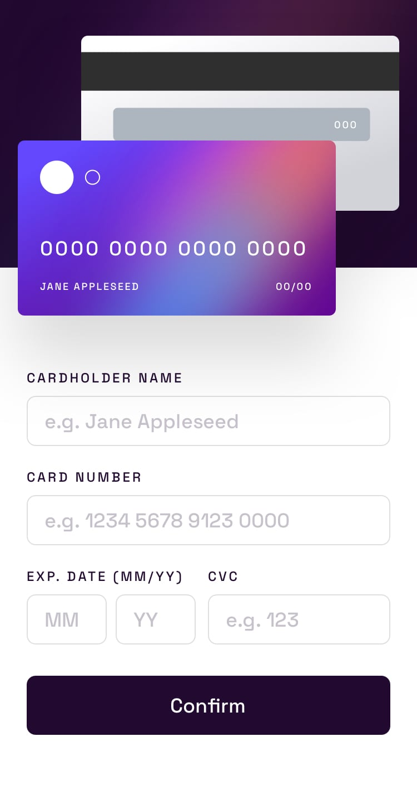

### Requirements

Your challenge is to build out this interactive card details form and get it looking as close to the design as possible.

Users should be able to:

- Fill in the form and see the card details update in real-time
- Receive error messages when the form is submitted if:
  - Any input field is empty
  - The card number, expiry date, or CVC fields are in the wrong format
- View the optimal layout depending on their device's screen size
- See hover, active, and focus states for interactive elements on the page
- Store, access and edit saved cards

### What you will learn

- Start a React project from scratch
- Get familiar with Chain Services
- Understand and be able to use utility functions: `setPath`, `getPath`, `cascadeFind`, `cascadeChange`, `scope`, ...
- CSS/SCSS good practices
- Responsive design
