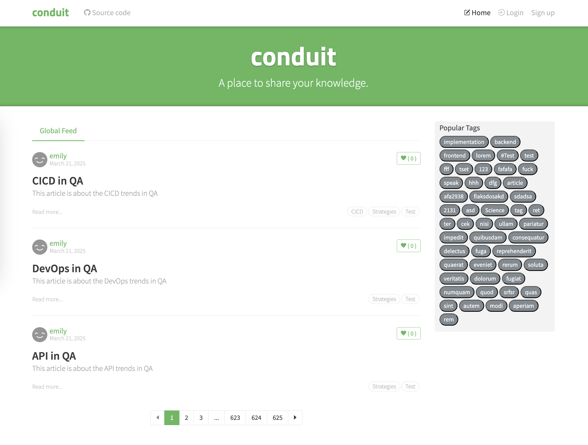

### Requirements

You will build **Conduit,** a clone of [Medium](https://medium.com/).

**Features**

- Authenticate users via JWT (login/signup pages + logout button on settings page)
- CRU- users (sign up & settings page - no deleting required)
- CRUD Articles
- CR-D Comments on articles (no updating required)
- GET and display paginated lists of articles
- Favorite articles
- Follow other users

**Routes**

- Home page (URL: /#/ )
  - List of tags
  - List of articles pulled from either Feed, Global, or by Tag
  - Pagination for list of articles
- Sign in/Sign up pages (URL: /#/login, /#/register )
  - Uses JWT (store the token in localStorage)
  - Authentication can be easily switched to session/cookie based
- Settings page (URL: /#/settings )
- Editor page to create/edit articles (URL: /#/editor, /#/editor/article-slug-here )
- Article page (URL: /#/article/article-slug-here )
  Delete article button (only shown to article’s author)
  Render markdown from server client side
  Comments section at bottom of page
  Delete comment button (only shown to comment’s author)
- Profile page (URL: /#/profile/:username, /#/profile/:username/favorites )
  - Show basic user info
  - List of articles populated from author’s created articles or author’s favorited articles

### What you will learn

- Reading comprehension: Frontend specs, API specs
- Project estimation
- Start a React project from scratch
- Understand and be able to use Chain Services
- Understand and be able to use utility functions: `setPath`, `getPath`, `cascadeFind`, `cascadeChange`, `scope`, ...
- Work with Git

### References

- **Specifications:** https://realworld-docs.netlify.app/introduction/
- https://github.com/gothinkster/realworld
